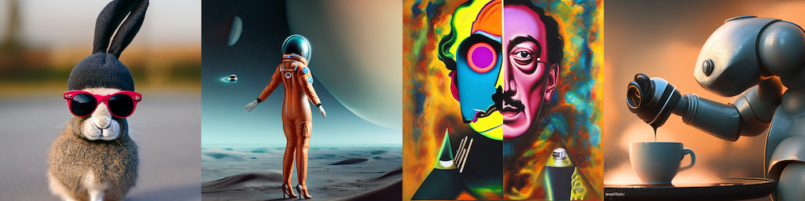
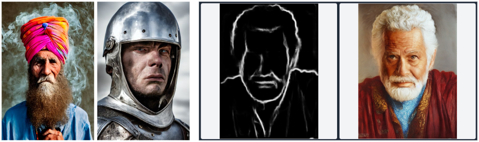
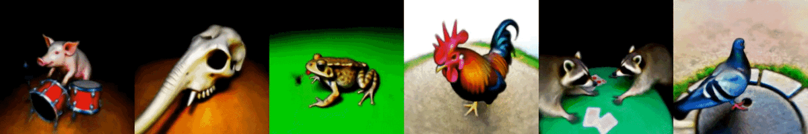

<div align=center>
  <h1>
    Latent Diffusion Applications
  </h1>
  <p>
    <a href=https://mhsung.github.io/kaist-cs479-fall-2023/ target="_blank"><b>KAIST CS479: Machine Learning for 3D Data (2023 Fall)</b></a><br>
    <Optional> Programming Assignment 5
  </p>
</div> 

<div align=center>
  <p>
    Instructor: <a href=https://mhsung.github.io target="_blank"><b>Minhyuk Sung</b></a> (mhsung [at] kaist.ac.kr)<br>
    TA: <a href=https://phillipinseoul.github.io/ target="_blank"><b>Yuseung Lee</b></a>  (phillip0701 [at] kaist.ac.kr)      
  </p>
</div>

<div align=center>
   
</div>
<div align=center>
  Source: Stable Diffusion v2
</div>

## Setup

Install the required package within the `requirements.txt`
```
pip install -r requirements.txt
```

## Task 0: Introduction 
To resolve the high computational demands of diffusion models and enhance their generation quality, [Rombach <i>et al.</i>](https://arxiv.org/abs/2112.10752) proposed <b>Latent Diffusion</b> in which the diffusion process takes place in a latent space instead of the RGB pixel space. Based on this paper, an open-source text-to-image generation model [<b>Stable Diffusion</b>](https://stability.ai/blog/stable-diffusion-public-release) was introduced in 2022 and has led to a wide variety of applications as presented in the below sections.

In this tutorial, we will have a hands-on experience with the basic pipeline of Stable Diffusion and further have a look at its applications including (i) Conditional Generation, (ii) Joint Diffusion, (iii) Zero-shot 3D Generation.

**[Introduction to Huggingface & Diffusers]**

Before going into main tasks on Latent Diffusion, we will have a look at [**Hugging Face**](https://huggingface.co/), an open-source hub for ML applications and [**Diffusers**](https://huggingface.co/docs/diffusers/index), a handy library for pretrained diffusion models. We will be loading the pretrained Stable Diffusion model from Diffusers for the remaining tasks. <br>

**TODO:**
```
Sign into Hugging Face and obtain the access token from `https://huggingface.co/settings/tokens`.
```

## Task 1: A Simple Practice on Stable Diffusion & ControlNet

<div align=center>
  
</div>

<div align=center>
  Source: (Left) Stable Diffusion, (Right) ControlNet
</div>

<br> In the past couple of years, numerous diffusion-based Text-to-Image (T2I) models have emerged such as Stable Diffusion, DALL-E 2 and Midjourney. In this section, we will do a simple hands-on practice with [**Stable Diffusion**](https://github.com/CompVis/stable-diffusion), which has been widely utilized in vision-based generative AI research projects. <br>
Moreover, to have a quick look at the **conditional generation** capabilities of Latent Diffusion, we will generate images with [**ControlNet**](https://github.com/lllyasviel/ControlNet) using various condition images such as depth maps and canny edge maps.

#### 1.1. A simple introduction to Stable Diffusion
Source code: `task_1_1_Stable_Diffusion_intro.ipynb`

**TODO:**
```
Load `StableDiffusionPipeline` and `DDIMScheduler` from Diffusers, and generate images with a text prompt.
```

#### 1.2. A deeper look at how Stable Diffusion works
Source code: `task_1_2_Stable_Diffusion_detailed.ipynb`

Different from the source code in `1.1`, in which we imported the full `StableDiffusionPipeline`, the code for `1.2` imports the inner modules of Stable Diffusion separately and defines the sampling process. <br><br>
**Understanding the inner sampling code for Stable Diffusion** can help us understand the generation process of diffusion models. For instance, the below GIF shows the visualizations of the decoded latents x_t at each timestep of the sampling process, along with the predicted x_0 at each timestep (See DDIM paper for details).

<div align=center>
  
</div>

<div align=center>
  (Left) At current timestep t, (Right) At initial timestep 0
</div>


**TODO:**
```
- Understand the sampling pipeline of Stable Diffusion.
- Visualize the intermediate and final outputs of the DDIM sampling process.
- Make a video of the sampling process of Stable Diffusion as below (You can use make_video.ipynb for converting images to video)
```

#### 1.3. Conditional generation with ControlNet
Source code: `task_1_3_ControlNet.ipynb`

Diffusers provides pretrained ControlNet models that can take various condtion images as input (e.g. depth map, canny edge map, segment masks) along with a text prompt. The source code provides the code for generating **canny edge maps** or **depth maps** from a source image and feeding them to a ControlNet model for conditional generation. Try the conditional generation with your own image data and also feel free to explore other types of conditions provided in [this link](https://huggingface.co/lllyasviel/sd-controlnet-depth#released-checkpoints).

**TODO:**
```
- Using your own image data, extract canny edge maps and depth maps and test conditional generation with ControlNet.
- Load a ControlNet model trained for another type of condition (e.g. normal maps, scribbles) and test with your own data.
- (Optional) Train a ControlNet model on any single condtion following the instructions in https://github.com/lllyasviel/ControlNet/blob/main/docs/train.md.
```


## Task 2: Extending Stable Diffusion to Arbitrary Resolutions by Joint Diffusions
Source code: `task_2_Joint_Diffusion.ipynb`

<div align=center>
  
</div>
<div align=center>
  Source: SyncDiffusion [Lee <i>et al.</i>]
</div>

Although Stable Diffusion has made a breakthrough in text-guided image generation, **one of its limitations is that it struggles to generate images of various resolutions**, such as long panorama images. Notably, the default resolution of the widely used Stable Diffusion model is fixed as 512x512. Recently, [MultiDiffusion](https://arxiv.org/abs/2302.08113) [Bar-Tal <i>et al.</i>] has proposed a simple solution to this issue, enabling the generation of arbitrary resolutions through joint diffusion processes using a pretrained Stable Diffusion. Moreover, [SyncDiffusion](https://arxiv.org/abs/2306.05178) [Lee <i>et al.</i>] further extends this idea by guiding the diffusion processes towards a globally coherent output. <br><br>
**In this task, we will begin from the simple Stable Diffusion pipeline from `1.2` and extend it to a joint diffusion pipeline based on the ideas from MultiDiffusion & SyncDiffusion.** This will let us generate an image of arbitrary resolution using a pretrained Stable Diffusion without any additional training.

#### 2.1. Implement a joint diffusion pipeline to enable the image generation of arbitrary resolutions
First, we will modifty the sampling pipeline of Stable Diffusion to enable the joint sampling of multiple diffusion processes as proposed in MultiDiffusion [Bar-Tal et al.]. You should fill in the parts of the source code marked with TODO. (It is recommended to implement in order of the given numbers next to TODO.) <br><br>
After implementing the below (1) ~ (3) TODOs, you will be able to run MultiDiffusion with the given sampling code.

**TODO:**
```
(1) Update the current window latent with the denoised latent. (NOTE: Follow Eq. (7) in MultiDiffusion paper))
(2) Keep track of overlapping regions of latents.
(3) For overlapping region of latents, take the average of the latent values (latent averaging)

After implementing upto (3), generate panorama images with your own text prompt. (Resolution HxW=512x2048)
```

#### 2.2. Improve the joint diffusion pipeline to generate globally coherent images
Now we will improve the joint diffusion pipeline implement in `2.1` to generate globally coherent images, as proposed in SyncDiffusion [Lee et al.]. After successfully implementing `2.1` you should starting filling in code starting from TODO (4). <br><br>
After implementing all TODOs, you can now switch the sampling method from MultiDiffusion from SyncDiffusion by setting `use_syncdiffusion` as True.

**TODO:**
```
(4) Obtain the `foreseen denoised latent (x_0)` of the anchor window, and decode the latent to obtain the anchor image. (See DDIM paper)
(5) Update the current window latent by gradient descent comparing the perceptual similarity of current window and the anchor window. (See the pseudocode in SyncDiffusion)

After implementing upto (5), compare the generated panoramas from MultiDiffusion and SyncDiffusion (using the same random seed).
```

**[Optional]** Add techniques to accelerate the sampling time using the tradeoff between (i) sampling time and (ii) coherence of generated image. (e.g. enabling gradient descent for certain timesteps, etc.)


## Task 3: Zero-Shot Text-Guided 3D Generation

<div align=center>
  
</div>
<div align=center>
  Source: DreamFusion [Poole <i>et al.</i>]
</div>


### Overall Code Structure of DreamFusion
```
. task_3_DreamFusion/ (Task 3)
├── freqencoder/                  <--- Implementation of frequency positional encodings
├── gridencoder/                  <--- Implementation of grid based positional encodings
├── nerf/
│   ├── network.py                <--- Original NeRF based network
│   ├── network_grid.py           <--- Hash grid based network
│   ├── provider.py               <--- Ray dataset 
│   ├── sd.py                     <--- (TODO) Stable Dreamfusion where you need to fill in SDS computation.
│   └── utils.py                  <--- utils for overall training.
├── raymarching/
├── encoding.py                   <--- Encoder based on positional encoding implementations.
├── main.py                       <--- main python script
└── optimizer.py
```

In this task, we will look into how a 2D diffusion model trained with a large-scale text-image dataset can be leveraged to generate 3D objects from text.
[DreamFusion](https://dreamfusion3d.github.io/) [Poole <i>et al.</i>] proposed a novel method, called Score Distillation Sampling (SDS), to distill a 2D diffusion prior for text-to-3D synthesis.

If we take a look at the objective function of diffusion models, it minimizes the difference between random noise $\epsilon$ and a model's predicted noise $\epsilon\_{\phi}$:

$$\mathcal{L}\_{\text{Diff}}(\phi, \mathbf{x}) = \mathbb{E}\_{t\sim U(0,1), \epsilon \sim \mathcal{N}(0, \mathbf{I})}[w(t) \Vert \epsilon\_{\phi}(\alpha\_t \mathbf{x} + \sigma\_{t} \epsilon; t) - \epsilon \Vert\_2^2 ] $$

If the model is already trained well, $\epsilon\_{\phi}$ would be similar to injected random noise $\epsilon$ as long as a given input image $\mathbf{x}$ follows the training data distribution. From this perspective, we can consider the objective function as a discriminator that tells how $\mathbf{x}$ looks realistic. 

SDS leverages this intuition to update 3D objects. Let say we have a differentiable image generator $\mathbf{x} = g(\theta)$ which is parameterized by $\theta$. We want to optimize $\theta$ so that $\mathbf{x}=g(\theta)$ looks like a sample from the frozen diffusion model. To perform this optimization, we can compute gradient of the diffusion model's objective function and backpropagate it to $\theta$:

$$\nabla\_{\theta} \mathcal{L}\_{\text{Diff}} (\phi, \mathbf{x}=g(\theta)) = \mathbb{E}\_{t, \epsilon}[ w(t) (\epsilon\_{\phi}(\alpha\_t \mathbf{x} + \sigma\_{t} \epsilon; t) - \epsilon) \frac{\partial \epsilon\_{\phi}(\mathbf{z}_t;y,t)}{\mathbf{z}_t} \frac{\partial \mathbf{x}}{\partial \theta}]$$,
where $\mathbf{z}_t$ is an intermediate latent of $\mathbf{x}$ at timestep $t$ and $y$ is a conditional text prompt.

However, in practice, U-Net Jacobian term $\frac{\partial \epsilon\_{\phi}(\mathbf{z}_t;y,t)}{\mathbf{z}_t}$ is computationally heavy and degrades the quality of results when conditioned for small noise levels. To circumvent this issue, the authors just omit the U-Net Jacobian term as follows:

$$\nabla\_{\theta} \mathcal{L}\_{\text{SDS}} (\phi, \mathbf{x}=g(\theta)) := \mathbb{E}\_{t, \epsilon}[ w(t) (\epsilon\_{\phi}(\alpha\_t \mathbf{x} + \sigma\_{t} \epsilon; t) - \epsilon) \frac{\partial \mathbf{x}}{\partial \theta}]$$

By setting $g(\theta)$ as NeRF, we can generate a 3D scene whchi is rendered to 2D images from arbitrary view points.

In short, we can synthesize NeRF scenes using a pre-trained 2D text-to-image diffusion model by SDS.

**TODO:**
```
- Fill in a function to compute the SDS loss in `sd.py` and generate 3D objects from text.

Generate scenes from a text prompt, and report 360 degree rendering videos. 

These are some example prompts you can try:
- "A hamburger",
- "A squirrel reading a book",
- "A bunny sitting on top of a stack of pancakes"  
```

## Resources
- [[blog](https://medium.com/@steinsfu/stable-diffusion-clearly-explained-ed008044e07e)]: Stable Diffusion Clearly Explained!
- [[website](https://huggingface.co/stabilityai/stable-diffusion-2-1)]: Hugging Face Stable Diffusion v2.1
- [[github](https://github.com/diff-usion/Awesome-Diffusion-Models)]: Awesome-Diffusion-Models
- [[github](https://github.com/lllyasviel/ControlNet)]: ControlNet
- [[paper](https://arxiv.org/abs/2112.10752)] High-Resolution Image Synthesis with Latent Diffusion Models
- [[paper](https://arxiv.org/abs/2205.11487)] Photorealistic Text-to-Image Diffusion Models with Deep Language Understanding
- [[paper](https://arxiv.org/abs/2302.05543)] Adding Conditional Control to Text-to-Image Diffusion Models
- [[paper](https://arxiv.org/abs/2301.07093)] GLIGEN: Open-Set Grounded Text-to-Image Generation
- [[paper](https://arxiv.org/abs/2208.01626)] Prompt-to-Prompt Image Editing with Cross Attention Control
- [[paper](https://arxiv.org/abs/2306.00986)] Diffusion Self-Guidance for Controllable Image Generation
- [[paper](https://arxiv.org/abs/2211.12446)] EDICT: Exact Diffusion Inversion via Coupled Transformations
- [[paper](https://arxiv.org/abs/2302.08113)] MultiDiffusion: Fusing Diffusion Paths for Controlled Image Generation
- [[paper](https://arxiv.org/abs/2306.05178)] SyncDiffusion: Coherent Montage via Synchronized Joint Diffusions
- [[paper](https://arxiv.org/abs/2307.01097)] MVDiffusion: Enabling Holistic Multi-view Image Generation with Correspondence-Aware Diffusion
- [[paper](https://arxiv.org/abs/2209.14988)] DreamFusion: Text-to-3D using 2D Diffusion
- [[paper](https://arxiv.org/abs/2212.00774)] Score Jacobian Chaining: Lifting Pretrained 2D Diffusion Models for 3D Generation
- [[paper](https://arxiv.org/abs/2305.16213)] ProlificDreamer: High-Fidelity and Diverse Text-to-3D Generation with Variational Score Distillation
- [[paper](https://arxiv.org/abs/2302.01721)] TEXTure: Text-Guided Texturing of 3D Shapes
- [[paper](https://arxiv.org/abs/2303.11396)] Text2Tex: Text-driven Texture Synthesis via Diffusion Models

### Acknowledgement
The code for Task 3 (DreamFusion) is heavily based on the implementation from [Stable-DreamFusion](https://github.com/ashawkey/stable-dreamfusion/tree/main).
